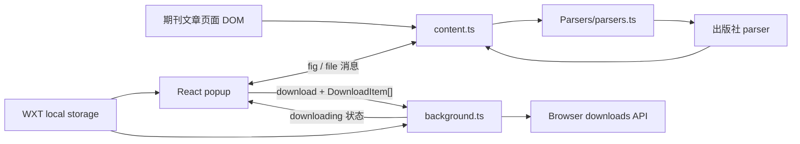
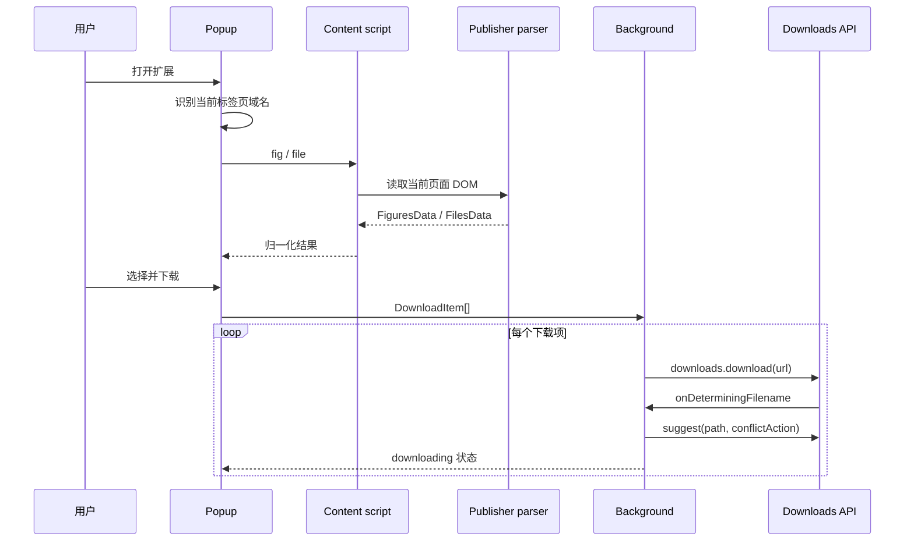

# 项目架构

## 概览

本项目是纯客户端浏览器扩展，没有服务端和数据库。WXT 负责生成 Manifest V3 扩展；React popup 展示解析结果；content script 读取当前论文页面 DOM；background service worker 调用浏览器 downloads、storage 和 tabs API。

## 运行时组件

### Popup UI

入口是 `entrypoints/popup/main.tsx`，主要状态和编排位于 `entrypoints/popup/App.tsx`。

- 查询当前活动标签页，用 `findJournalForUrl` 判断出版社。
- 分别向 content script 请求 `FiguresData` 和 `FilesData`。
- `FigCard`、`FileCard` 管理预览、单选和全选；`OptionCard` 保存下载目录与重名策略。
- effect 将所有选中项经 `info2Download` 投影为 `DownloadItem[]`。
- 点击下载后向 background 发送任务，并监听 background 的进度消息。

UI 使用 Tailwind CSS + DaisyUI；Framer Motion 只用于图片详情的展开动画；MDX 只用于 changelog 页面。

### Content script 与解析器

`entrypoints/content.ts` 注入八类出版社页面，监听两种消息：

- `action: "fig"`：调用 `getFiguresFrom`，兼容同步解析器和 OUP 异步解析器。
- `action: "file"`：调用同步的 `getFilesFrom`。

`Parsers/parsers.ts` 是唯一注册表。它负责 URL 到站点键的识别，并将站点键分派到 `Parsers/` 下的实现：Nature、ACS、Wiley、Science、ScienceDirect、OUP、RSC、PNAS。各实现直接查询当前页面 DOM，把出版社特有结构归一为共享数据类型。

### Background 下载层

`entrypoints/background.ts` 负责三个生命周期：

1. 收到 `DownloadItem[]` 后逐项调用 `chrome.downloads.download`。
2. `onDeterminingFilename` 根据 storage 配置重命名为 `<article>/<name>.<ext>` 并设置冲突策略。
3. 向 popup 发送 `downloading` 消息；安装或升级时打开 changelog，并存储当前版本。

下载设置使用两个 local storage 键：

| 键 | 类型 | 默认值 | 用途 |
| --- | --- | --- | --- |
| `local:download-folder` | `boolean` | `false` | 是否按文章目录重命名 |
| `local:download-conflict` | `uniquify \| overwrite` | `uniquify` | 文件名冲突策略 |

## 数据模型

`types/parser.d.ts` 定义跨运行上下文的数据协议：

- `FigInfo`：编号、名称、预览 URL、原图 URL、选中状态。
- `FileInfo`：编号、名称、原始 URL、文件类型、选中状态。
- `FiguresData`：文章标题、出版社、图文摘要、正文图、补充图及存在标记。
- `FilesData`：文章 PDF、补充文件以及尚未被 UI 使用的源码文件字段。

`types/download.d.ts` 定义下载协议：`DownloadItem` 是 parser 数据去除 UI 字段后的下载项；`Task` 保存 background 当前下载批次的游标；`downloadStatus` 是发回 popup 的进度快照。

## 关键数据流

## 构建与发布

- `wxt.config.ts` 指定默认 Edge、Chrome 扩展 API、React/MDX Vite 插件及 `activeTab`、`downloads`、`storage` 权限。
- `pnpm build` 默认生成 Edge MV3；脚本另含 Chrome/Firefox 构建和打包命令。
- `.github/workflows/build2zip.yml` 在 push 和 pull request 上安装依赖，构建 Edge/Chrome，并上传 `.output/*-mv3`。
- `.wxt/`、`.output/` 和 `node_modules/` 都是生成物，不属于源码。

## 当前架构约束

- parser 依赖第三方站点 DOM 和资源 URL 规则，站点改版是主要故障来源。
- popup 打开时即时解析，没有缓存、重试或明确的“不支持/页面未加载”错误状态。
- 下载任务以进程内 `Set<Task>` 保存；service worker 重启后不恢复，也尚未可靠区分并发批次。
- Playwright 已配置但仓库没有 `e2e/` 测试，解析器也没有固定 DOM 样例，因此当前正确性主要依赖真实页面手测。

